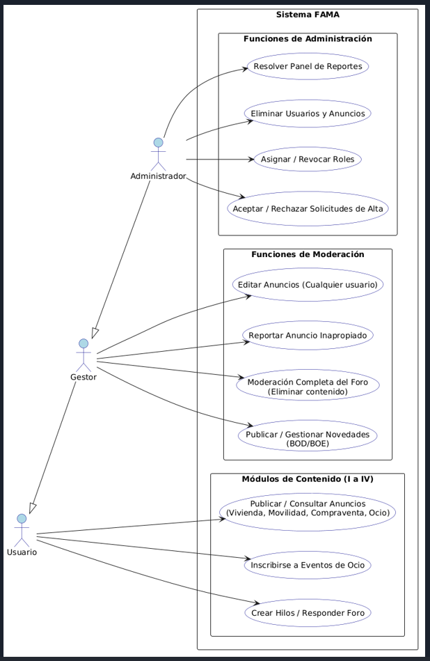
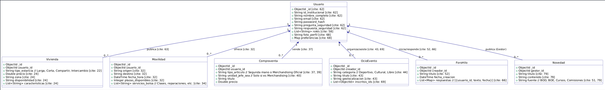
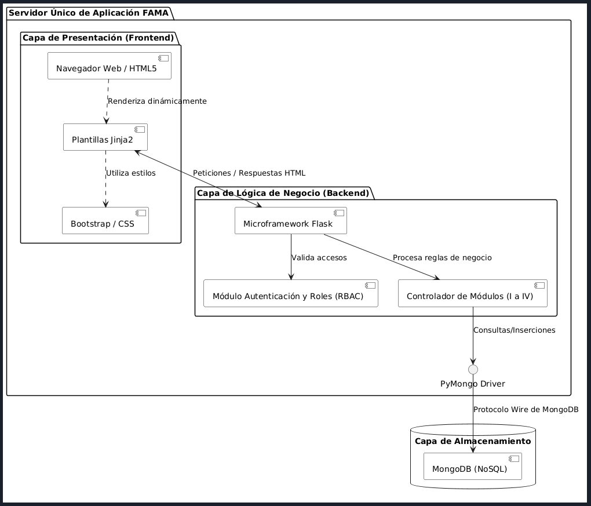
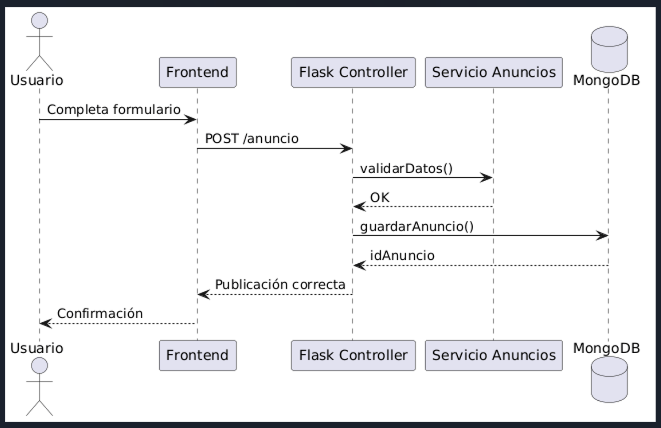
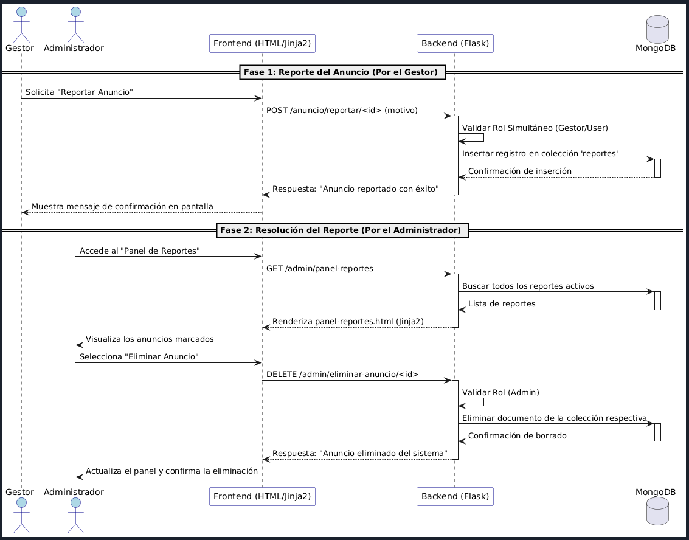

# 4 ESQUEMAS, DIAGRAMAS Y MODELOS DE DATOS

## 4.1 DIAGRAMA DE CASOS:

Este diagrama ilustra las fronteras del sistema y cómo interactúan los tres actores principales (Usuario, Gestor y Administrador) con los módulos de FAMA. Refleja fielmente la herencia y acumulación de roles descrita (el Gestor hereda del Usuario; el Administrador hereda del Gestor/Usuario) , permitiendo visualizar el Control de Acceso Basado en Roles (RBAC).

## 4.2 DIAGRAMA DE CLASES - MODELO DE DOCUMENTOS (Base de Datos NoSQL):

Dado que el sistema utiliza MongoDB (una base de datos NoSQL orientada a documentos) , un diagrama de clases tradicional se adapta aquí para representar los esquemas o colecciones de documentos JSON/BSON de estructura variable. Muestra las entidades principales del backend (Python/PyMongo), sus atributos clave y las relaciones lógicas (referencias por ID).

## 4.3 DIAGRAMA DE COMPONENTES (Arquitectura Monolítica):

Este diagrama describe la estructura física y lógica del monolito integrado. Ilustra cómo la capa de Presentación (Frontend) basada en Jinja2 y Bootstrap interactúa directamente en el mismo servidor con la Lógica de Negocio (Backend) en Flask , la cual se comunica con la persistencia en MongoDB a través de PyMongo.

## 4.4 DIAGRAMA DE SECUENCIA - PUBLICACIÓN DE ANUNCIO:

Para entender la interacción dinámica entre componentes, este diagrama modela EL flujo cuando un usuario publica un anuncio en cualquiera de los módulos.

## 4.5 DIAGRAMA DE SECUENCIA - FLUJO DE REPORTE Y MODERACIÓN DE CONTENIDO:

Para entender la interacción dinámica entre componentes y los privilegios de los diferentes roles , este diagrama modela un flujo crítico del sistema: un Gestor detecta un anuncio inapropiado, lo reporta, y el Administrador actúa de manera definitiva eliminándolo del sistema a través del panel administrativo.

