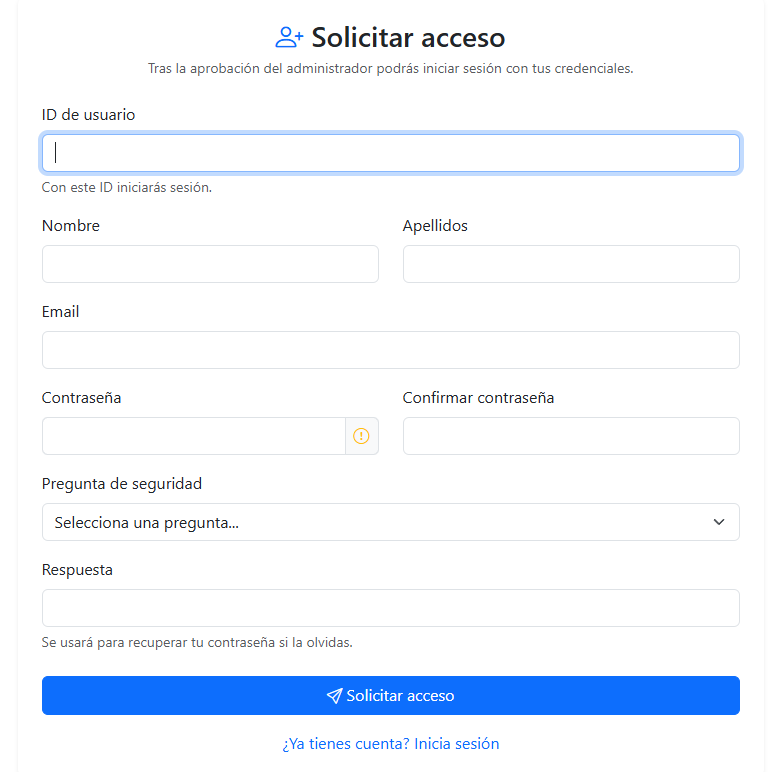

# 6 MANUAL DE USUARIO - FAMA -
## Plataforma Web - Foro de Apoyo Multipropósito de la Armada

### Tabla de Contenidos

1. [Bienvenida](#bienvenida)
2. [Primeros Pasos](#primeros-pasos)
3. [Interfaz Principal](#interfaz-principal)
4. [Gestión de Cuenta](#gestión-de-cuenta)
5. [Módulo Viviendas](#módulo-viviendas)
6. [Módulo Servicios](#módulo-servicios)
7. [Módulo Compra-Venta](#módulo-compra-venta)
8. [Módulo Ocio y Eventos](#módulo-ocio-y-eventos)
9. [Foro Comunitario](#foro-comunitario)
10. [Sistema de Roles y Permisos](#sistema-de-roles-y-permisos)
11. [Panel de Administración](#panel-de-administración)
12. [Preguntas Frecuentes](#preguntas-frecuentes)
13. [Troubleshooting](#troubleshooting)

## Bienvenida

¡Bienvenido a **FAMA** (Foro de Apoyo Multipropósito de la Armada)!

FAMA es una plataforma web diseñada para facilitar la comunicación y colaboración entre el personal de la Armada. A través de FAMA, puedes:

- 🏠 Encontrar o publicar ofertas de vivienda
- 💼 Ofrecer o buscar servicios
- 🛍️ Comprar y vender artículos de segunda mano
- 🎉 Organizar y participar en eventos
- 💬 Participar en debates comunitarios
- 📢 Recibir novedades y anuncios importantes

## Primeros Pasos

### Acceso a la Aplicación

1. Abre tu navegador web (Chrome, Firefox, Safari, Edge)
2. Ingresa la URL del servidor FAMA
3. Si está disponible HTTPS, la conexión será segura (busca el candado en la barra)

### Registro de Cuenta

El registro es el primer paso para usar FAMA:

1. **En la página de inicio**, haz clic en **"Registro"**

2. **Completa el formulario** con la siguiente información:



3. **Valida tu contraseña**: Debe cumplir estos criterios para mayor seguridad:
   - ✓ Mínimo 8 caracteres
   - ✓ Al menos una letra mayúscula (A-Z)
   - ✓ Al menos una letra minúscula (a-z)
   - ✓ Al menos un número (0-9)
   - ✓ Al menos un carácter especial (!@#$%^&*)

4. **Envía el formulario**: Haz clic en **"Registrarse"**

5. **Espera validación**: Tu cuenta quedará pendiente de validación por un administrador. Recibirás una notificación cuando tu cuenta esté activada.

### Inicio de Sesión

Una vez tu cuenta esté validada:

1. Ve a la página de **"Iniciar Sesión"**
2. Ingresa tu **ID de usuario** y **contraseña**
3. Haz clic en **"Entrar"**
4. Serás redirigido a tu panel personal

### Recuperación de Contraseña

Si olvidas tu contraseña:

1. En la página de login, haz clic en **"¿Olvidaste tu contraseña?"**
2. Se te pedirá que **respondas tu pregunta de seguridad**
3. Si la respuesta es correcta, se **generará una contraseña temporal**
4. **Cambia la contraseña** en tu primer acceso
   - Ve a **Perfil → Cambiar Contraseña**
   - Ingresa la contraseña temporal
   - Define una nueva contraseña segura

## Interfaz Principal

### Estructura de la Página

```
┌─────────────────────────────────────────────────┐
│ Logo FAMA    [Menu]    Hola, Usuario  [Perfil]  │  ← Barra de Navegación
├─────────────────────────────────────────────────┤
│                                                 │
│  Dashboard / Contenido Principal                │
│  (Varía según donde estés)                      │
│                                                 │
├─────────────────────────────────────────────────┤
│ © FAMA - Foro de Apoyo Multipropósito Armada    │  ← Footer
└─────────────────────────────────────────────────┘
```

### Barra de Navegación

La barra superior contiene:

- **Logo FAMA**: Haz clic para volver a la página de inicio
- **Menú Principal**: Acceso a todos los módulos
- **Novedades** ⭐: Badge que muestra si hay novedades sin leer
- **Panel Admin** (solo para gestores y admins): Acceso a controles administrativos
- **Perfil**: Acceso a tu cuenta y configuración
- **Salir**: Cierra tu sesión

### Menú Principal

Accede al menú desde el botón de hamburguesa o haciendo clic en "Menú":

| Opción | Descripción |
|--------|------------|
| **Inicio** | Vuelve al dashboard principal |
| **Viviendas** | Módulo de ofertas de vivienda |
| **Servicios** | Módulo de ofertas y búsqueda de servicios |
| **Compra-Venta** | Módulo de artículos en venta |
| **Ocio** | Módulo de eventos y actividades |
| **Foro** | Debates y conversaciones comunitarias |
| **Novedades** | Anuncios oficiales de la plataforma |
| **Perfil** | Tu página personal |
| **Panel Admin** | (Solo admins y gestores) |

## Gestión de Cuenta

### Acceder a tu Perfil

1. Haz clic en tu nombre o foto en la esquina superior derecha
2. Selecciona **"Perfil"**

### Información de tu Perfil

Tu perfil muestra:

- **Foto de Perfil**: Tu avatar
- **Nombre Completo**: Nombre y apellidos
- **ID de Usuario**: Tu identificador único
- **Email**: Tu correo de contacto
- **Rol**: Tu nivel de permisos (Usuario, Gestor, Administrador)
- **Fecha de Registro**: Cuándo te registraste
- **Estado**: Activo/Inactivo

### Editar tu Perfil

1. En tu página de perfil, haz clic en **"Editar Perfil"**
2. Actualiza los campos que desees:
   - Nombre real
   - Apellidos
   - Foto de perfil (JPG, PNG, GIF, WebP - máx. 5 MB)
3. Haz clic en **"Guardar Cambios"**

### Cambiar Contraseña

Para cambiar tu contraseña:

1. Ve a **Perfil → Cambiar Contraseña**
2. Introduce tu **contraseña actual** (para verificar tu identidad)
3. Introduce tu **nueva contraseña** dos veces
4. Verifica que cumpla los requisitos de seguridad
5. Haz clic en **"Cambiar Contraseña"**

**Nota**: Si olvidas tu contraseña actual, usa el enlace "¿Olvidaste tu contraseña?" en login.

### Foto de Perfil

**Requisitos**:
- Formatos: JPG, PNG, GIF, WebP
- Tamaño máximo: 5 MB
- Recomendación: 200x200 px (se redimensionará automáticamente)

**Para subir tu foto**:
1. Ve a **Perfil → Editar Perfil**
2. En la sección "Foto de Perfil", haz clic en **"Cambiar Foto"**
3. Selecciona la imagen de tu dispositivo
4. Haz clic en **"Guardar Cambios"**

## Módulo Viviendas

### Descripción

El módulo **Viviendas** facilita:
- Buscar y publicar ofertas de alquiler
- Organizar intercambios de vivienda
- Encontrar compañero de piso
- Compartir gastos de vivienda

### Crear un Anuncio de Vivienda

1. Ve a **Viviendas → Nuevo Anuncio** (botón "+" o "Publicar")

2. **Tipo de Oferta** (elige una):
   - 🏠 **Alquiler**: Ofrecer vivienda en alquiler
   - ↔️ **Intercambio**: Intercambiar vivienda de forma temporal
   - 🤝 **Compartir**: Buscar compañero de piso

3. **Información de la Propiedad**:
   - **Tipo de Inmueble**: Piso, Estudio, Chalet, Ático, Finca
   - **Ubicación**: Ciudad
   - **Zona/Barrio**: Barrio específico
   - **Habitaciones**: Número de dormitorios
   - **Baños**: Número de cuartos de baño
   - **Planta**: En qué piso se encuentra
   - **Precio**: Precio mensual (si aplica)

4. **Características Adicionales** (marca las que apliquen):
   - ☑ Garaje
   - ☑ Ascensor
   - ☑ Permitidas mascotas
   - ☑ Amueblada
   - ☑ Calefacción
   - ☑ Aire acondicionado

5. **Contacto**:
   - **Teléfono**: Tu número de teléfono para contacto

6. **Descripción**:
   - Detalla las características, amenities, reglas, etc.
   - Máximo 2000 caracteres

7. **Fotos** (opcional):
   - Sube hasta 5 imágenes del inmueble
   - Formatos: JPG, PNG, GIF, WebP
   - Tamaño máximo por foto: 5 MB

8. **Validez**:
   - El anuncio se mantendrá visible durante 90 días
   - Se renovará automáticamente
   - Se eliminará automáticamente si expira

9. Haz clic en **"Publicar"**

### Ver Anuncios

1. Ve a **Viviendas** para ver el listado
2. Usa los **filtros** para refinar tu búsqueda:
   - Tipo de oferta
   - Ciudad
   - Precio (rango mín-máx)
   - Número de habitaciones
   - Características

3. Haz clic en un anuncio para ver **detalles completos**:
   - Galería de fotos
   - Todas las características
   - Información de contacto del anunciante
   - Ubicación en mapa (si está disponible)

### Editar tu Anuncio

1. Ve a **Viviendas**
2. Busca tu anuncio
3. Haz clic en **"Editar"**
4. Modifica los campos que desees
5. Haz clic en **"Guardar Cambios"**

### Eliminar tu Anuncio

1. En **Viviendas**, encuentra tu anuncio
2. Haz clic en **"Eliminar"**
3. Confirma la eliminación

## Módulo Servicios

### Descripción

El módulo **Servicios** permite:
- Ofrecer servicios (tutorías, trabajos, etc.)
- Buscar servicios disponibles
- Conectar proveedores con solicitantes
- Gestionar contrataciones

### Tipos de Servicios

| Tipo | Descripción | Ejemplo |
|------|------------|---------|
| **Viajes Compartidos** | Compartir vehículos | Ir al trabajo juntos |
| **Clases de Apoyo** | Tutorías y enseñanza | Clases de idiomas |
| **Trabajos** | Servicios varios | Reparaciones, mudanzas |

### Publicar un Servicio

1. Ve a **Servicios → Nuevo Anuncio**

2. **Tipo** (elige uno):
   - 📢 **Ofrecer**: Tú proporcionas el servicio
   - 🔍 **Buscar**: Buscas que alguien lo proporcione

3. **Categoría**: Selecciona la categoría del servicio

4. **Información del Servicio**:
   - **Título**: Descripción breve y clara
   - **Precio**: Coste del servicio (si aplica)
   - **Modalidad**: 
     - 🏠 Presencial
     - 💻 Online
     - 🔄 Ambas

5. **Contacto**:
   - **Teléfono**: Número para contactar

6. **Ubicación**:
   - **Ciudad**: Lugar donde se presta el servicio

7. **Descripción Detallada**:
   - Explica en qué consiste el servicio
   - Horarios disponibles
   - Requisitos especiales
   - Máximo 2000 caracteres

8. **Fotos** (opcional):
   - Hasta 5 imágenes demostrativas
   - Máximo 5 MB cada una

9. Haz clic en **"Publicar"**

### Buscar Servicios

1. Ve a **Servicios**
2. Aplica **filtros**:
   - Tipo (Oferta/Búsqueda)
   - Categoría
   - Modalidad (Presencial/Online)
   - Ciudad

3. Haz clic en un resultado para ver detalles y **contactar** al prestador

## Módulo Compra-Venta

### Descripción

**Compra-Venta** es tu plataforma para:
- Vender artículos de segunda mano
- Comprar artículos a otros usuarios
- Acceder a tienda oficial de la Armada
- Intercambiar objetos

### Categorías

- 🖥️ Electrónica
- 🛋️ Mobiliario
- 📚 Libros
- 👕 Ropa
- 🎮 Entretenimiento
- 🏠 Hogar
- 🛠️ Herramientas
- 🎯 Armada (Tienda oficial)

### Publicar un Artículo

1. Ve a **Compra-Venta → Nuevo Anuncio**

2. **Información del Artículo**:
   - **Nombre**: Qué estás vendiendo
   - **Categoría**: Clasificación del artículo
   - **Precio**: Valor actual
   - **Descripción**: 
     - Estado (nuevo, excelente, bueno, aceptable)
     - Defectos o detalles
     - Razón de venta
     - Máximo 2000 caracteres

3. **Contacto**:
   - **Teléfono**: Para que te contacten
   - **Email** (opcional): Alternativa de contacto

4. **Ubicación**:
   - **Ciudad**: Dónde está ubicado
   - **Zona**: Barrio específico (opcional)

5. **Fotos**:
   - Sube hasta 5 fotos claras del artículo
   - Diferentes ángulos recomendados
   - Máximo 5 MB por foto

6. Haz clic en **"Publicar"**

### Ver Artículos

1. Accede a **Compra-Venta**
2. Navega por categorías o usa buscador
3. Aplica **filtros**:
   - Rango de precio
   - Categoría
   - Estado del artículo
   - Ciudad

4. Haz clic en un artículo para **ver detalles completos**:
   - Galería de fotos
   - Descripción detallada
   - Precio
   - Datos de contacto del vendedor

### Marcar como Vendido

Cuando vendas un artículo:

1. Ve a **Compra-Venta**
2. Encuentra tu anuncio
3. Haz clic en **"Marcar como Vendido"**
4. El anuncio seguirá visible pero indicará "VENDIDO"

## Módulo Ocio y Eventos

### Descripción

**Ocio** facilita:
- Organizar eventos y actividades
- Encontrar eventos próximos
- Inscribirse en eventos
- Gestionar el aforo de eventos

### Tipos de Eventos

- ⚽ Actividades Deportivas
- 🎭 Eventos Sociales
- 🎨 Actividades Culturales
- 🤝 Reuniones de Compañerismo
- 🚶 Excursiones y Viajes

### Crear un Evento

1. Ve a **Ocio → Nuevo Evento** (botón "+")

2. **Información Básica**:
   - **Nombre del Evento**: Título descriptivo
   - **Tipo**: Deporte, Social, Cultural, etc.
   - **Descripción**: Detalles del evento
     - Qué se hará
     - Por qué es interesante
     - Requisitos o preparación necesaria
     - Máximo 2000 caracteres

3. **Fecha y Hora**:
   - **Fecha**: Día del evento
   - **Hora**: Hora de inicio

4. **Ubicación**:
   - **Lugar**: Descripción exacta del lugar
   - **Ciudad**: Ciudad donde se realiza

5. **Capacidad**:
   - **Aforo Máximo**: Número máximo de participantes
   - Importante: Si es ilimitado, indicar "Sin límite"

6. **Costo** (opcional):
   - **Hay Entrada**: ¿Hay que pagar?
   - **Precio**: Cantidad a cobrar por persona

7. **Contacto**:
   - **Teléfono**: Número del organizador

8. **Fotos** (opcional):
   - Cartel o imagen del evento
   - Máximo 5 MB

9. Haz clic en **"Publicar Evento"**

### Ver Calendario de Eventos

1. Ve a **Ocio → Calendario**
2. Visualiza todos los eventos próximos en formato calendario
3. Haz clic en un evento para **ver detalles**

### Inscribirse en un Evento

1. Ve a **Ocio** o **Calendario**
2. Encuentra el evento que te interesa
3. Haz clic en **"Inscribirse"**
4. Confirma tu inscripción
5. Recibirás confirmación con detalles

### Ver Inscritos

Si organizas un evento:

1. Ve a **Ocio**
2. Busca tu evento
3. Haz clic en **"Ver Inscritos"**
4. Lista de todos los participantes confirmados

### Cancelar Inscripción

Si cambias de opinión:

1. Ve a **Ocio → Mis Eventos**
2. Busca el evento
3. Haz clic en **"Cancelar Inscripción"**
4. Tu lugar se liberará para otros

## Foro Comunitario

### Descripción

El **Foro** es el espacio para:
- Compartir opiniones y experiencias
- Hacer preguntas
- Debatir temas de interés común
- Conectar con otros usuarios

### Estructura del Foro

El foro está organizado en **canales temáticos**:

- 💬 **General**: Conversaciones generales
- 📋 **Vivienda**: Sobre temas de vivienda
- 💼 **Servicios**: Sobre servicios
- 🛍️ **Compra-Venta**: Sobre artículos
- 🎉 **Ocio**: Sobre eventos y actividades
- 🆘 **Ayuda y Soporte**: Preguntas sobre la plataforma

### Crear un Tema

1. Ve a **Foro**
2. Selecciona el **canal** apropiado
3. Haz clic en **"Nuevo Tema"**

4. **Información del Tema**:
   - **Título**: Breve y descriptivo
   - **Contenido**: Tu pregunta o punto de vista
     - Sé claro y específico
     - Máximo 5000 caracteres

5. **Fotos** (opcional):
   - Hasta 5 imágenes
   - Máximo 5 MB cada una

6. Haz clic en **"Publicar Tema"**

### Responder en un Tema

1. Abre el tema que te interesa
2. Desplázate al final
3. Haz clic en el campo de respuesta
4. Escribe tu respuesta
5. (Opcional) Añade fotos o archivos
6. Haz clic en **"Publicar Respuesta"**

### Buscar en el Foro

1. Ve a **Foro**
2. Usa la **barra de búsqueda**
3. Ingresa palabras clave
4. Se mostrarán temas relevantes

### Etiquetado de Temas

Los temas pueden tener etiquetas:

- 🔴 **Sin respuesta**: Nadie ha respondido aún
- 🟢 **Resuelto**: Se encontró solución
- 📌 **Importante**: Tema destacado
- 🔒 **Cerrado**: No se pueden añadir respuestas

## Sistema de Roles y Permisos

### Tres Niveles de Acceso

#### 👤 Usuario Regular

**Permisos básicos**:
- ✓ Ver todos los anuncios
- ✓ Crear anuncios propios
- ✓ Editar sus propios anuncios
- ✓ Eliminar sus propios anuncios
- ✓ Participar en foro
- ✓ Inscribirse en eventos
- ✓ Ver información de otros usuarios

**Restricciones**:
- ✗ No puede ver panel de administración
- ✗ No puede editar anuncios de otros
- ✗ No puede ver logs

#### 👨‍💼 Gestor

**Permisos adicionales**:
- ✓ Acceder a panel de gestión
- ✓ Ver lista de usuarios
- ✓ Editar información de usuarios
- ✓ Resetear contraseñas (genera temporal)
- ✓ Moderar contenidos
- ✓ Ver estadísticas generales
- ✓ Ver algunos logs
- ✓ Reportar anuncios inapropiados

**Responsabilidades**:
- Garantizar contenido apropiado
- Ayudar a usuarios en problemas
- Revisar reportes de contenido

#### 👨‍💻 Administrador

**Permisos máximos**:
- ✓ Todo lo que hace un Gestor, más:
- ✓ Cambiar roles de usuarios
- ✓ Eliminar usuarios permanentemente
- ✓ Ver y exportar logs completos
- ✓ Eliminar logs
- ✓ Acceso total a administración
- ✓ Gestión de configuración global

**Responsabilidades**:
- Gestión general de la plataforma
- Decisiones estratégicas
- Seguridad y auditoría

## Panel de Administración

### Acceso

El panel de administración solo está disponible para **Gestores** y **Administradores**.

Para acceder:
1. Busca el botón **"Panel Admin"** en la barra de navegación
2. O ve a **Perfil → Panel Administrativo**

### Secciones del Panel

#### Dashboard Principal

Muestra estadísticas de la plataforma:
- Total de usuarios (activos/inactivos)
- Usuarios pendientes de validación
- Total de anuncios por módulo
- Estado de la aplicación

#### Gestión de Usuarios

**Listar Usuarios**:
1. Ve a **Usuarios**
2. Busca por nombre o email
3. Filtra por estado (activo/inactivo)
4. Pagina los resultados

**Acciones por Usuario**:

| Acción | Quién | Qué hace |
|--------|-------|----------|
| **Ver Detalles** | Gestor+ | Ver perfil completo |
| **Editar** | Gestor+ | Cambiar nombre, email |
| **Resetear Contraseña** | Gestor+ | Genera password temporal |
| **Cambiar Rol** | Admin | Cambiar a Usuario/Gestor/Admin |
| **Validar Cuenta** | Gestor+ | Aprobar usuario pendiente |
| **Desactivar** | Admin | Inhabilitar cuenta |
| **Eliminar** | Admin | Eliminar permanentemente |

#### Logs de Auditoría

**Ver Logs**:
1. Ve a **Logs**
2. Filtra por:
   - Tipo (Registro/Control)
   - Usuario que realizó la acción
   - Fecha

**Acciones**:
- 📊 **Ver Detalles**: Información completa del log
- 📥 **Exportar PDF**: Descargar informe
- 🗑️ **Eliminar**: Borrar log (solo admin)

#### Reportes

**Ver Reportes**:
1. Ve a **Reportes**
2. Lista de anuncios/usuarios reportados como inapropiados

**Acciones**:
- 👁️ **Ver**: Inspeccionar el contenido reportado
- ✅ **Resolver**: Marcar reporte como atendido
- 🗑️ **Eliminar**: Eliminar reporte del sistema

#### Gestión Manual

**Subir/Editar Manual**:
- Solo **Administrador**
- Sección para documentación interna
- Permite subir PDFs de procedimientos

## Preguntas Frecuentes

### Sobre la Plataforma

**P: ¿Es FAMA solo para personal de la Armada?**

R: Sí, FAMA está diseñada específicamente para facilitar la comunicación entre el personal de la Armada. El acceso está restringido a cuentas autorizadas.

**P: ¿Cuánto cuesta usar FAMA?**

R: FAMA es completamente gratuita para todos los usuarios autorizados.

**P: ¿Cómo contacto con soporte?**

R: Puedes contactar a través del foro en la sección "Ayuda y Soporte" o comunicarte con un administrador.

### Sobre Cuentas y Seguridad

**P: ¿Cuál es la mejor contraseña?**

R: Una contraseña fuerte debe tener:
- Mínimo 8 caracteres
- Mezcla de mayúsculas y minúsculas
- Números
- Caracteres especiales (!@#$%^&*)
- Evita datos personales fáciles de adivinar

**P: ¿Qué hago si olvido mi contraseña?**

R: En la página de login, haz clic en "¿Olvidaste tu contraseña?" y responde tu pregunta de seguridad. Se generará una contraseña temporal que podrás cambiar.

**P: ¿Puedo cambiar mi pregunta de seguridad?**

R: Por ahora no. Asegúrate de responder correctamente durante el registro.

**P: ¿Mis datos están seguros?**

R: Sí. La plataforma usa:
- Conexión HTTPS encriptada
- Contraseñas hasheadas (no almacenadas en texto claro)
- Firewall y protecciones de seguridad
- Auditoría de accesos

### Sobre Anuncios

**P: ¿Cuánto tiempo permanece un anuncio?**

R: Los anuncios permanecen visibles durante 90 días. Después expiran automáticamente pero puedes republicar.

**P: ¿Puedo cambiar un anuncio después de publicarlo?**

R: Sí. Haz clic en "Editar" en tu anuncio y guarda los cambios.

**P: ¿Cuántos anuncios puedo tener?**

R: No hay límite establecido. Puedes publicar tantos como necesites.

**P: ¿Cómo reporto un anuncio inapropiado?**

R: En la página del anuncio, haz clic en "Reportar" e indica el motivo. Un administrador revisará tu reporte.

**P: ¿Se pueden ver mis datos personales en los anuncios?**

R: Solo se muestra tu nombre de usuario, foto de perfil (si has subido una) y teléfono de contacto que tú proporciones. Tu email no se publica.

### Sobre Privacidad

**P: ¿Quién puede ver mi email?**

R: Tu email solo lo ven:
- Los administradores de la plataforma
- Las personas que hagas contactos privados

**P: ¿Puede alguien ver mi historial de anuncios?**

R: Tu perfil público muestra los anuncios activos. Los históricos no son visibles para otros usuarios.

**P: ¿Cómo me doy de baja?**

R: Contacta con un administrador. Podrán desactivar tu cuenta de forma temporal o permanente.

### Sobre Módulos Específicos

**P: ¿Cómo reconozco un anuncio de vivienda de confianza?**

R: Busca:
- ✓ Descripción detallada
- ✓ Múltiples fotos claras
- ✓ Usuario con historial
- ✓ Datos de contacto completos

**P: ¿Qué hago si alguien no responde a mi solicitud de servicio?**

R: Puedes:
1. Probar con otra persona
2. Reportar el comportamiento a administración
3. Dejar comentario en su perfil (si aplica)

**P: ¿Cómo me inscribo en un evento con aforo lleno?**

R: El sistema no permite inscripciones adicionales. Puedes:
- Ponerte en lista de espera (si está disponible)
- Contactar al organizador directamente
- Buscar eventos similares

**P: ¿Puedo cancelar mi inscripción en un evento?**

R: Sí, en cualquier momento. Solo ve a "Mis Eventos" y haz clic en "Cancelar Inscripción".

## Troubleshooting

### No puedo acceder a mi cuenta

**Síntomas**:
- ❌ "Usuario o contraseña incorrectos"
- ❌ Cuenta bloqueada
- ❌ No puedo hacer login

**Soluciones**:
1. Verifica que tu **ID de usuario** y **contraseña** son correctos
2. Asegúrate de que tu **cuenta está validada** (chequea tu correo para confirmación)
3. Si olvidaste la contraseña, usa "¿Olvidaste tu contraseña?"
4. Limpia caché del navegador: `Ctrl+Shift+Supr`
5. Intenta con otro navegador
6. Contacta con administración

### Las fotos no se suben correctamente

**Síntomas**:
- ❌ Error al seleccionar imagen
- ❌ Foto aparece borrosa o rotada
- ❌ Tamaño de archivo muy grande

**Soluciones**:
1. **Formatos permitidos**: JPG, PNG, GIF, WebP
2. **Tamaño máximo**: 5 MB por foto
3. **Resolución recomendada**: 1024x768 px mínimo
4. Comprime la imagen si es muy grande:
   - Usa herramientas online (tinypng.com)
   - O software local (IrfanView, PhotoShop)
5. Intenta con otro navegador

### No puedo editar mis anuncios

**Síntomas**:
- ❌ Botón "Editar" no responde
- ❌ No veo mis anuncios
- ❌ Dice que no tengo permisos

**Soluciones**:
1. Verifica que hayas **iniciado sesión**
2. Asegúrate de que el anuncio sea **tuyo**
   - Solo puedes editar tus propios anuncios
3. Si el anuncio ha **expirado**, publícalo de nuevo
4. Recarga la página: `F5`
5. Limpia caché y cookies

### La aplicación va lenta

**Síntomas**:
- ⏳ Páginas cargan despacio
- ⏳ Se congela al subir archivos
- ⏳ Botones responden lentamente

**Soluciones**:
1. **Verifica tu conexión**: ¿Tienes conexión a internet rápida?
2. **Reduce pestañas abiertas**: Cierra navegadores/aplicaciones
3. **Limpia caché**: `Ctrl+Shift+Supr` → Borrar caché
4. **Actualiza navegador**: Descarga la última versión
5. **Intenta con conexión directa**: Si usas VPN, intenta sin ella
6. **Intenta en otro navegador**: Chrome, Firefox, Edge

### Recibo un error 403 o "Acceso Denegado"

**Síntomas**:
- ❌ Mensaje de "Acceso Denegado"
- ❌ No puedo acceder a sección de admin
- ❌ No puedo editar anuncio de otro usuario

**Soluciones**:
1. Verifica tu **rol de usuario**:
   - Algunos módulos requieren permisos específicos
   - Solo admin/gestor pueden ver panel de administración
2. Si intentas editar anuncio de otro:
   - Solo puedes editar los tuyos
   - Los admin/gestor pueden editar cualquiera
3. Verifica que tu **cuenta está activa**
4. Contacta con administración si crees que es un error

### No veo mis cambios después de guardar

**Síntomas**:
- ✓ Aparece "Guardado con éxito"
- ❌ Pero los cambios no se ven
- ❌ Los datos se revertieron

**Soluciones**:
1. **Recarga la página**: `F5` o `Ctrl+R`
2. **Limpia caché**:
   - Windows: `Ctrl+Shift+Supr`
   - Mac: `Cmd+Shift+Supr`
3. **Cierra y reabre navegador**
4. **Intenta en incógnito**: Elimina variables de caché local
5. Si persiste, contacta con soporte

### Error de certificado SSL

**Síntomas**:
- ⚠️ "Su conexión no es privada"
- ⚠️ "Certificado de seguridad no válido"
- 🔓 No sale el candado en HTTPS

**Soluciones**:
1. Verifica que la **URL sea correcta**
2. Intenta acceder a través de **IP** en lugar de dominio
3. Limpia fechas y hora del sistema (si es error de expiración)
4. Intenta en otro dispositivo o red
5. Contacta con administración si el problema persiste

### No recibo notificaciones

**Síntomas**:
- ❌ No me entero de respuestas en foro
- ❌ No veo novedades importantes
- ❌ No recibo alertas de eventos

**Soluciones**:
1. **Verifica tu email**: Revisa bandeja de entrada y spam
2. **Activa notificaciones**: 
   - Ve a Perfil → Configuración
   - Asegúrate que las notificaciones están habilitadas
3. **Comprueba navegador**: Algunos navegadores requieren permiso para notificaciones
4. **Actualiza preferencias**: En tu perfil, revisa las opciones de notificación

## Contacto y Soporte

### ¿Cómo contactar con soporte?

**Opciones de contacto**:

1. **Foro**: Sección "Ayuda y Soporte"
   - Ideal para preguntas generales
   - Otros usuarios pueden ayudarte

2. **Administrador**:
   - A través del panel de contacto en la aplicación
   - O busca en la lista de usuarios con rol "Administrador"

3. **Email**: (Proporcionar email de soporte si está disponible)

### Reporte de Bugs

Si encuentras un error:

1. Describe exactamente qué hiciste antes del error
2. Nota el mensaje de error exacto (si lo hay)
3. Indica el navegador y versión que usas
4. Si es posible, incluye una captura de pantalla
5. Contacta con administración con esta información

### Sugerencias y Mejoras

¿Tienes una idea para mejorar FAMA?

1. Comparte tu sugerencia en el foro
2. O contacta directamente con administración
3. Tu feedback es valioso para mejorar la plataforma

## Últimas Notas

- **Privacidad**: FAMA respeta tu privacidad. Lee los términos de servicio.
- **Responsabilidad**: Eres responsable del contenido que publiques.
- **Respeto**: Trata a otros usuarios con respeto.
- **Seguridad**: Nunca compartas tu contraseña con nadie.
- **Reporte**: Si ves contenido inapropiado, repórtalo.

---

**Última actualización**: Junio de 2026
**Versión**: 2.0

¡Esperamos que disfrutes usando FAMA! 🎉
